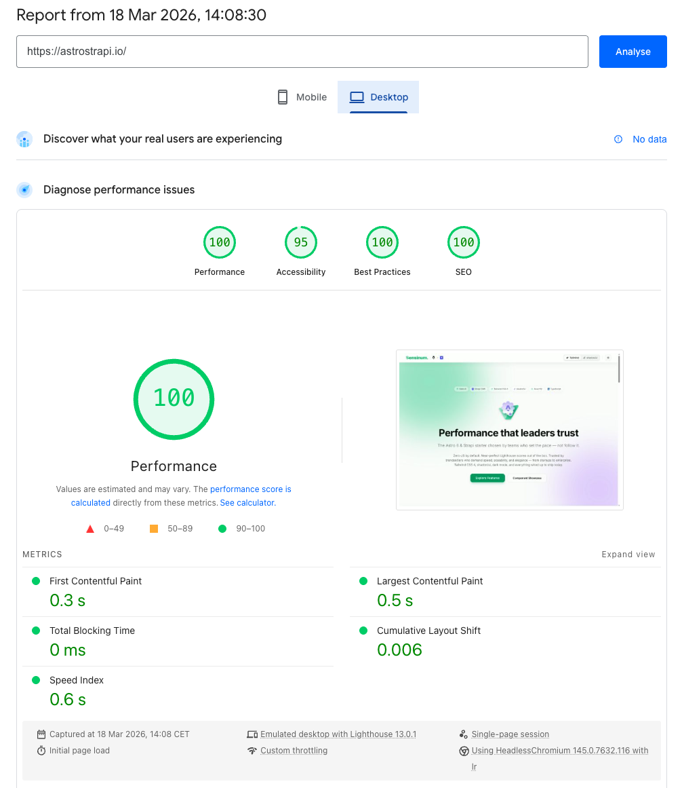
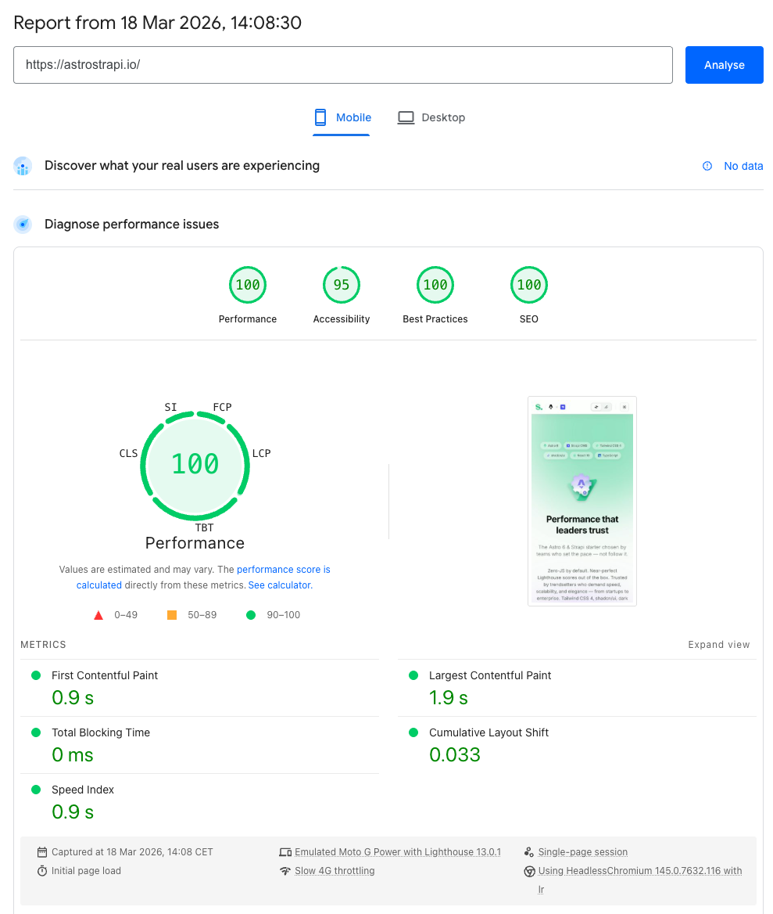

<div align="center" style="max-width: 10rem; margin: 0 auto">
  
</div>
<div align="center" style="margin-bottom: 2rem">
  <h1>Astro x Strapi Starter</h1>
  <p style="max-width: 36rem; margin: 0.5rem auto 0.75rem; line-height: 1.5"><strong>AI-native first</strong> — agent context (<code>AGENTS.md</code>), <a href="./.ai/">Agent Skills</a> under <code>.ai/</code>, and <a href="./.cursor/rules/">Cursor rules</a> are part of the product, not a README afterthought. You extend the stack with AI, not against it.</p>
  <a href="https://astrostrapi.io/"><strong>🔗 Live Demo</strong></a>
</div>

All-in-one starter combining Astro, Strapi CMS, TailwindCSS, and shadcn/ui with support for **[Strapi Astro Loader](https://github.com/VirtusLab-Open-Source/astro-strapi-loader)** and **[Strapi Astro Blocks Field](https://github.com/VirtusLab-Open-Source/astro-strapi-blocks)**. Details: [AI-native support](#-ai-native-support).

---

## ✨ Features

- ⚡ **Astro 6** - Latest version with ultra-fast static sites
- 📝 **Strapi CMS** - Headless CMS for content management
- 🧱 **Strapi Astro Blocks Field** - Modular & flexible content block system
- 🔄 **Strapi Astro Loader** - Automatic content loading from Strapi
- 🤖 **AI-native support** - `AGENTS.md`, Agent Skills under `.ai/`, and Cursor rules tailored to Astro x Strapi for Loader &amp; Blocks
- 🎨 **TailwindCSS 4** - Modern utility-first CSS styling
- 🧩 **shadcn/ui** - Pre-configured React component library (optional)
- 🌗 **Dark / Light mode** - Toggle with system preference detection
- 🔀 **Tailwind / shadcn toggle** - Live component showcase comparing both approaches
- 🔤 **Inter font** - Self-hosted variable font via `@fontsource`
- 📱 **Responsive Design** - Optimized for all devices
- 🌐 **TypeScript** - Full type support


---

## 📖 Table of Contents

- [✨ Features](#-features)
- [🚀 Quick Start](#-quick-start)
- [🗂️ Project Structure](#️-project-structure)
- [🤖 AI-native support](#-ai-native-support)
- [🏆 Lighthouse Score](#-lighthouse-score)
- [🌗 Dark / Light Mode](#-dark--light-mode)
- [🧩 UI Components: shadcn/ui vs Pure Tailwind](#-ui-components-shadcnui-vs-pure-tailwind)
- [📦 Strapi Astro Packages](#-strapi-astro-packages)
- [🔨 Available Commands](#-available-commands)
- [🌍 Deploy](#-deploy)
- [📚 Useful Links](#-useful-links)
- [🔧 Development](#-development)
- [🤝 Contributing](#-contributing)
- [📄 License](#-license)

---

## 🚀 Quick Start

### 1. Use a starter template

```bash
# NPM
yarn create astro@latest -- --template VirtusLab-Open-Source/astro-strapi-starter

# Yarn
yarn create astro --template VirtusLab-Open-Source/astro-strapi-starter
```

### 2. Environment Variables Setup

Create a `.env` file in the root directory:

```env
# Strapi Configuration
STRAPI_URL=http://localhost:1337
STRAPI_TOKEN=your_strapi_api_token_here
```

### 3. Run the Project

```bash
yarn dev
```

Open [http://localhost:4321](http://localhost:4321) in your browser.

## 🗂️ Project Structure

```
/
├── src/
│   ├── components/
│   │   ├── blocks/                # Strapi block components (Astro + Tailwind)
│   │   │   ├── BlockRenderer.astro
│   │   │   ├── TextBlock.astro
│   │   │   ├── QuoteBlock.astro
│   │   │   ├── MediaBlock.astro
│   │   │   ├── CTABlock.astro
│   │   │   └── HeroBlock.astro
│   │   ├── tailwind/              # Pure Tailwind Astro components
│   │   │   ├── Button.astro
│   │   │   ├── Card.astro
│   │   │   ├── CardHeader.astro
│   │   │   ├── CardTitle.astro
│   │   │   ├── CardDescription.astro
│   │   │   ├── CardContent.astro
│   │   │   └── Badge.astro
│   │   ├── ui/                    # shadcn/ui React components
│   │   │   ├── button.tsx
│   │   │   ├── card.tsx
│   │   │   ├── badge.tsx
│   │   │   └── separator.tsx
│   │   ├── showcase/              # Side-by-side component demos
│   │   │   ├── TailwindShowcase.astro
│   │   │   └── ShadcnShowcase.tsx
│   │   ├── Toolbar.astro          # Sticky header with logo + toggles
│   │   ├── ThemeToggle.astro      # Dark / Light mode switch
│   │   └── UIToggle.astro         # Tailwind / shadcn switch
│   ├── lib/
│   │   └── utils.ts               # cn() utility for class merging
│   ├── pages/
│   │   └── index.astro            # Homepage
│   ├── types/
│   │   └── strapi/                # Strapi TS types (`index.ts` re-exports modules)
│   ├── content.config.ts          # Strapi Loader configuration
│   ├── styles/
│   │   └── global.css             # Theme, fonts, toggle visibility rules
│   └── utils/
│       └── media.ts               # Strapi Media utils
├── components.json                # shadcn/ui configuration
├── package.json
└── astro.config.mjs
```

## 🤖 AI-native support

This starter ships first-class **agent context** for any AI coding tool (Cursor, Claude Code, Copilot, and other SKILL.md–compatible clients):

- **[`AGENTS.md`](./AGENTS.md)** (root) points to the full guide: **[`.ai/AGENTS.md`](./.ai/AGENTS.md)**
- **Agent Skills** (YAML + markdown) under **`.ai/`**:
  - [`.ai/astro-strapi-starter/SKILL.md`](./.ai/astro-strapi-starter/SKILL.md) — end-to-end workflow for this template (the only long-form skill kept here)
  - [`.ai/astro-strapi-loader/SKILL.md`](./.ai/astro-strapi-loader/SKILL.md) and [`.ai/astro-strapi-blocks/SKILL.md`](./.ai/astro-strapi-blocks/SKILL.md) — **short stubs** with links to the canonical **SKILL** (and related) files in [`astro-strapi-loader`](https://github.com/VirtusLab-Open-Source/astro-strapi-loader/tree/main/.ai) and [`astro-strapi-blocks`](https://github.com/VirtusLab-Open-Source/astro-strapi-blocks/tree/main/.ai) (no duplicate prose in this repo)
- **Cursor project rules** in [`.cursor/rules/`](./.cursor/rules/) — [`astro-strapi-loader`](./.cursor/rules/astro-strapi-loader.mdc) and [`astro-strapi-blocks`](./.cursor/rules/astro-strapi-blocks.mdc) are **thin pointers** to the [loader](https://github.com/VirtusLab-Open-Source/astro-strapi-loader/blob/main/.cursor/rules/astro-strapi-loader.mdc) and [blocks](https://github.com/VirtusLab-Open-Source/astro-strapi-blocks/blob/main/.cursor/rules/astro-strapi-blocks.mdc) upstream rules; [`astro-strapi-starter`](./.cursor/rules/astro-strapi-starter.mdc) and [`tailwind-shadcn`](./.cursor/rules/tailwind-shadcn.mdc) are defined in this repo

The authoritative manuals for the packages live in those upstream `.ai` trees. Pin a **tag or commit** in the raw-GitHub URLs to match your `package.json` version when you need strict reproducibility.

To use a skill in a tool that only loads from `.cursor/skills/`, copy or symlink [`.ai/astro-strapi-starter/`](./.ai/astro-strapi-starter) there. For loader and blocks, copy from upstream raw URLs (see the stub files) or fetch them in your tool if it supports **URL-based** skills.

## 🏆 Lighthouse Score

Nearly perfect scores out of the box — no extra optimization needed.

| Desktop | Mobile |
|---------|--------|
|  |  |

## 🌗 Dark / Light Mode

The starter includes a theme toggle in the header. It:

- Detects system preference on first visit
- Saves choice to `localStorage`
- Renders an inline script in `<head>` to prevent flash of wrong theme
- Toggles the `dark` class on `<html>` — all semantic tokens adapt automatically

All components use semantic color tokens (`text-foreground`, `bg-card`, `border-border`, etc.) so dark mode works everywhere out of the box.

## 🧩 UI Components: shadcn/ui vs Pure Tailwind

This starter ships with **two parallel component sets** — switch between them live using the toggle in the header.

### Pure Tailwind (Astro)

Components in `src/components/tailwind/` are `.astro` files styled with Tailwind utility classes. Zero JavaScript, server-rendered.

```astro
---
import Button from "@/components/tailwind/Button.astro";
import Card from "@/components/tailwind/Card.astro";
import CardHeader from "@/components/tailwind/CardHeader.astro";
import CardTitle from "@/components/tailwind/CardTitle.astro";
import CardContent from "@/components/tailwind/CardContent.astro";
---

<Card>
  <CardHeader>
    <CardTitle>My Card</CardTitle>
  </CardHeader>
  <CardContent>
    <Button variant="outline">Click me</Button>
  </CardContent>
</Card>
```

### shadcn/ui (React)

Components in `src/components/ui/` are React components built on [Radix UI](https://www.radix-ui.com/) primitives. Accessible, composable, interactive.

```astro
---
import { Button } from "@/components/ui/button";
import { Card, CardHeader, CardTitle, CardContent } from "@/components/ui/card";
---

<Card>
  <CardHeader>
    <CardTitle>My Card</CardTitle>
  </CardHeader>
  <CardContent>
    <Button client:load variant="outline">Click me</Button>
  </CardContent>
</Card>
```

### Adding More shadcn/ui Components

```bash
npx shadcn@latest add dialog dropdown-menu tabs
```

### Removing shadcn/ui

If you prefer pure Tailwind only:

1. Delete `src/components/ui/`, `src/components/showcase/ShadcnShowcase.tsx`, and `src/lib/utils.ts`
2. Delete `components.json`
3. Remove `@astrojs/react` from `astro.config.mjs` (if not using React elsewhere)
4. Uninstall: `yarn uninstall @astrojs/react radix-ui class-variance-authority clsx tailwind-merge lucide-react tw-animate-css shadcn`

## 📦 Strapi Astro Packages

- [`@sensinum/astro-strapi-loader`](https://github.com/VirtusLab-Open-Source/astro-strapi-loader) — Automatic content loading from Strapi
- [`@sensinum/astro-strapi-blocks`](https://github.com/VirtusLab-Open-Source/astro-strapi-blocks) — Modular & flexible block rendering

## 🔨 Available Commands

| Command                | Action                                     |
| :--------------------- | :----------------------------------------- |
| `yarn install`          | Installs dependencies                      |
| `yarn dev`          | Starts dev server at `localhost:4321`      |
| `yarn build`        | Build your production site to `./dist/`    |
| `yarn preview`      | Preview your build locally                 |
| `yarn astro ...`    | Run CLI commands like `astro add`, `astro check` |

## 🌍 Deploy

### Vercel
1. Connect your repository to Vercel
2. Add environment variables in project settings
3. Deploy!

### Netlify
1. Connect your repository to Netlify
2. Set build command: `yarn build`
3. Set publish directory: `dist`
4. Add environment variables

## 📚 Useful Links

- [Astro Documentation](https://docs.astro.build)
- [TailwindCSS Documentation](https://tailwindcss.com/docs)
- [shadcn/ui Documentation](https://ui.shadcn.com)
- [Strapi Documentation](https://docs.strapi.io)
- [Sensinum Astro Strapi Loader](https://github.com/VirtusLab-Open-Source/astro-strapi-loader)
- [Sensinum Astro Strapi Blocks Field](https://github.com/VirtusLab-Open-Source/astro-strapi-blocks)

## 🔧 Development

1. Clone the repository
2. Install dependencies:

```bash
yarn install
```

3. Run development mode:

```bash
yarn dev
```

4. Check types:

```bash
npx astro check
```

## 🤝 Contributing

We welcome contributions to this project! Here's how you can help:

1. Fork the repository
2. Create your feature branch (`git checkout -b feature/amazing-feature`)
3. Commit your changes (`git commit -m 'Add some amazing feature'`)
4. Push to the branch (`git push origin feature/amazing-feature`)
5. Open a Pull Request

Please make sure to:
* Follow the existing code style
* Write tests for new features
* Update documentation as needed
* Keep your PR focused and concise

## 📄 License

Copyright © [Sensinum](https://sensinum.com)

This project is licensed under the MIT License - see the [LICENSE.md](LICENSE.md) file for details.
